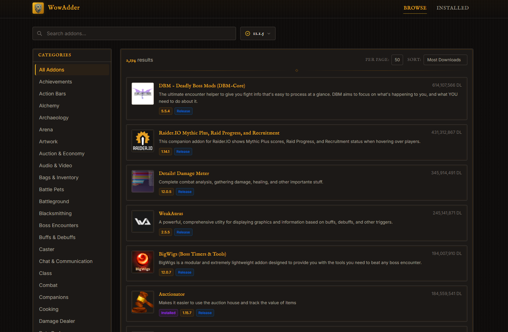
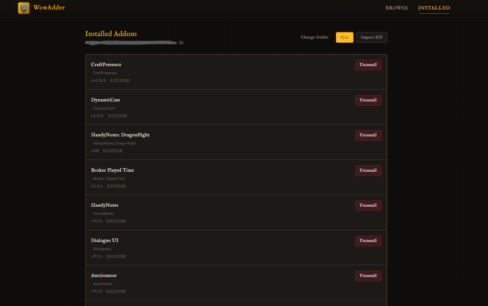

<!-- <div align="center">
  
</div> -->

<br/>

<div align="center">
  
</div>

<h1 align="center">WowAdder</h1>

<p align="center">
  <strong>A lightweight, native World of Warcraft addon manager</strong>
  <br/>
  Built with Tauri v2, React 19, and the CurseForge Core API v2.
  <br/>
  No Electron. No ads. No accounts. Just addons.
</p>

<p align="center">
  <a href="#features">Features</a> •
  <a href="#how-its-different">How It's Different</a> •
  <a href="#getting-started">Getting Started</a> •
  <a href="#tech-stack">Tech Stack</a> •
  <a href="#license--policies">License & Policies</a>
</p>

---

<div align="center">
  
</div>

## Features

<p align="center">
  
  <br/>
  <em>Browse, search, and filter addons from CurseForge</em>
</p>

<p align="center">
  
  <br/>
  <em>Manage installed addons with update checking and batch operations</em>
</p>

- **Browse & search** — Search addons by name with debounced input. Query is persisted across sessions.
- **Multi-category filtering** — Sidebar with 60+ CurseForge categories. Three-state toggle: include, exclude, or ignore. Active filter counts shown per section.
- **Game version selection** — Filter addons by specific WoW patch versions. Multiple versions can be selected simultaneously and are searched via raw API requests.
- **One-click install** — Installs directly to `Interface/AddOns` with structured progress tracking (stage labels + progress bars via Tauri events).
- **CurseForge deep link** — Registers the `curseforge://` protocol so "Install with CurseForge" buttons open in WowAdder instead of the official client.
- **Version-aware file picker** — Browse all files for an addon, filtered by game version, with pagination. Shows release type, upload date, and file size.
- **External addon detection** — Scans `Interface/AddOns` for unmanaged addons by parsing `.toc` metadata files. Matches them to CurseForge entries for import.
- **Batch sync** — Match and adopt multiple external addons at once with progress tracking.
- **Update checking** — Checks all installed addons against the latest CurseForge releases. Shows per-addon status (up-to-date, update available, downgrade available, or error). One-click update install with progress feedback and confirmation dialog comparing versions.
- **ZIP import** — Import addon ZIP archives directly via the Rust backend. Supports auto-deletion after install.
- **CurseForge author links** — Author names are clickable links to their CurseForge profiles.
- **Support Developers mode** — Toggle that routes installs through CurseForge download pages (counting your download) instead of direct CDN. Watches specified folders for the downloaded ZIP and installs automatically.
- **Customizable themes** — 5 color schemes inspired by WoW: Classic Gold, Emerald Green, Crimson, Night Elf Purple, and Frost Blue. Heading font picker with 20+ fantasy fonts.
- **Auto-updater** — Built-in Tauri updater with changelog dialog. Checks for new versions on launch and in Settings.

## How It's Different

### Lightweight & Native (No Electron)

Built on [**Tauri v2**](https://v2.tauri.app/) with a Rust backend and compiled installers (~5 MB per platform). No Electron overhead, no bundled Chromium, no excessive RAM usage. The frontend is a lean React 19 + [Tailwind CSS v4](https://tailwindcss.com/) app served by your OS's native webview.

Available for **Windows** (MSI + NSIS), **Linux** (deb + AppImage + rpm), and **macOS** (DMG + app bundle).

### No Account, No Ads, No Tracking

Connects directly to the **CurseForge Core API v2** (official API) using a bundled key. No CurseForge account needed. No ads. No telemetry. No background processes. Just launch and go.

### CurseForge Downloads

By default, installing opens the CurseForge download page directly in your browser, instantly starting the download — supporting addon authors by counting your downloads. WowAdder watches your download folders and imports the ZIP automatically. Disable "Support Developers" in Settings to use the CDN directly for a one-click flow.

### Smart Addon Detection

Scans your `Interface/AddOns` folder by parsing `.toc` metadata files. Detects addons installed outside WowAdder and can match and adopt them into its database — no manual reinstallation required.

### Safe Upgrades

When upgrading an addon, downloads and extracts the new version before removing old folders — eliminating the window where addon files are missing if something goes wrong mid-update.

### Multi-Folder Addon Support

Handles addons that span multiple folders. Tracks all folder names per addon for clean uninstall and upgrade.

### Structured Install Progress

Installs emit real-time progress events with stage labels (downloading, extracting, updating database, cleaning up) and percentage progress bars.

---

## Getting Started

### Prerequisites

- Windows, Linux, or macOS

### Installation

1. Download the latest installer for your platform from [Releases](https://github.com/TheGloved1/WowAdder/releases) or [Downloads](https://gloved.dev/wowadder/download)
2. Run the installer
3. Launch WowAdder and select your World of Warcraft `Interface/AddOns` folder

### Building from Source

> **WARNING**: Building from source requires you to use your own CurseForge API key. You can get one by creating an account at [CurseForge for Studios](https://studios.curseforge.com/) and then going to [CurseForge Console](https://console.curseforge.com/#/api-keys).

```bash
bun install
bun run sync-version
bun tauri build
```

Requires [Bun](https://bun.sh/) and [Rust](https://www.rust-lang.org/).

---

## Tech Stack

| Layer             | Technology                                                                                                                             |
| ----------------- | -------------------------------------------------------------------------------------------------------------------------------------- |
| Desktop Framework | [Tauri v2](https://v2.tauri.app/) (Rust backend)                                                                                       |
| Frontend          | React + TypeScript                                                                                                                     |
| Data Fetching     | TanStack Query                                                                                                                         |
| UI Components     | [shadcn/ui](https://ui.shadcn.com/) + Radix primitives                                                                                 |
| Icons             | [Lucide React](https://lucide.dev/)                                                                                                    |
| Styling           | Tailwind CSS v4                                                                                                                        |
| API               | [`CurseForge API`](https://docs.curseforge.com/rest-api/) via [`curseforge-v2`](https://www.npmjs.com/package/curseforge-v2) and fetch |
| Routing           | React Router                                                                                                                           |
| Markdown          | react-markdown                                                                                                                         |
| Build Tool        | Vite                                                                                                                                   |
| Package Manager   | Bun                                                                                                                                    |
| License           | [MIT](./LICENSE)                                                                                                                       |

---

## License & Policies

- [MIT License](./LICENSE) — WowAdder is free and open-source software
- [Privacy Policy](./PRIVACY.md) — What data is collected and how it's used
- [Terms of Service](./TERMS.md) — Terms governing use of this software
